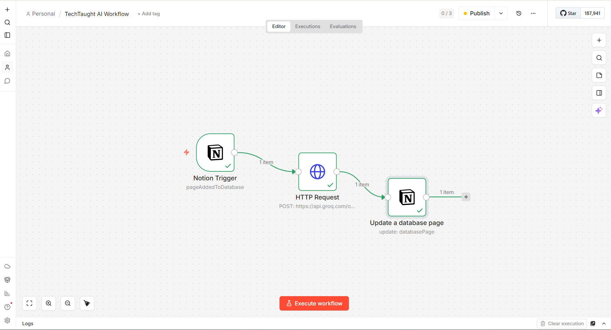
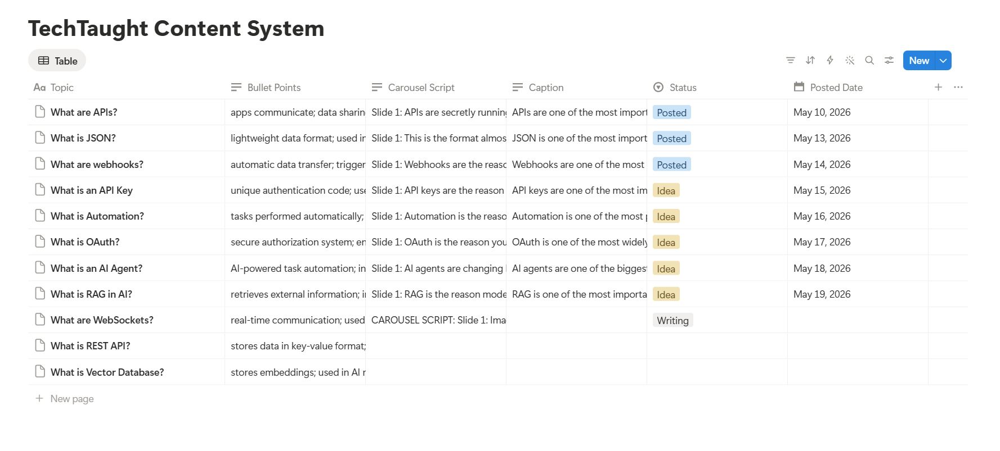
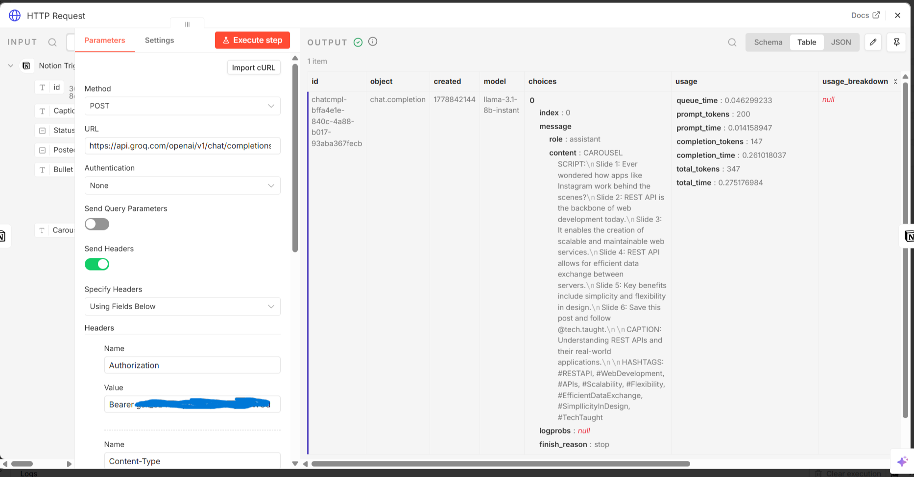
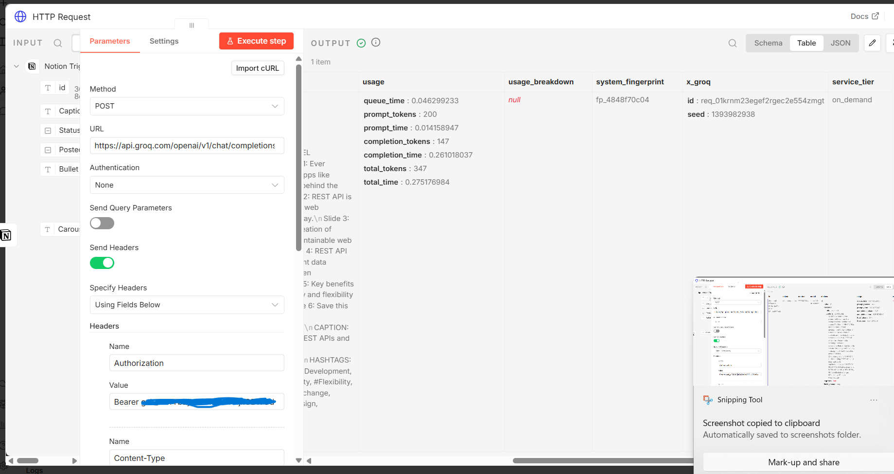

# AI Content Automation System

An AI-powered content automation workflow built using **n8n**, **Notion**, and **Groq API** to automatically generate Instagram carousel scripts, captions, and hashtags for tech-focused educational content.

---

## Features

* Automated Notion-triggered workflow
* AI-generated Instagram carousel scripts
* Automatic caption & hashtag generation
* Dynamic content pipeline using Groq API
* Status-based workflow management
* Structured content organization inside Notion
* Event-driven automation using n8n

---

## Workflow Architecture

```text
Notion Database
↓
n8n Trigger Automation
↓
Groq AI API Processing
↓
Carousel Script Generation
↓
Automatic Database Update
```

---

## Tech Stack

* n8n
* Notion API
* Groq API
* REST APIs
* JSON
* Workflow Automation

---

## Example Workflow

1. Add a topic and bullet points inside Notion
2. Workflow automatically triggers in n8n
3. Groq AI generates:

   * Carousel Script
   * Caption
   * Hashtags
4. Content is automatically updated back into Notion
5. Status changes from `Idea` → `Writing`

---

## Future Improvements

* Automated carousel image generation
* Canva/APITemplate integration
* Auto-posting to social platforms
* Trending topic detection
* Analytics dashboard
* Multi-platform content generation
* AI hook optimization

---

## Project Goal

The goal of this project is to explore practical AI workflow automation and scalable content-generation pipelines using APIs and event-driven systems.

---

## Screenshots

## Screenshots

### Workflow Architecture


### Notion Database


### Generated Output




---

## Author

Yash Shah